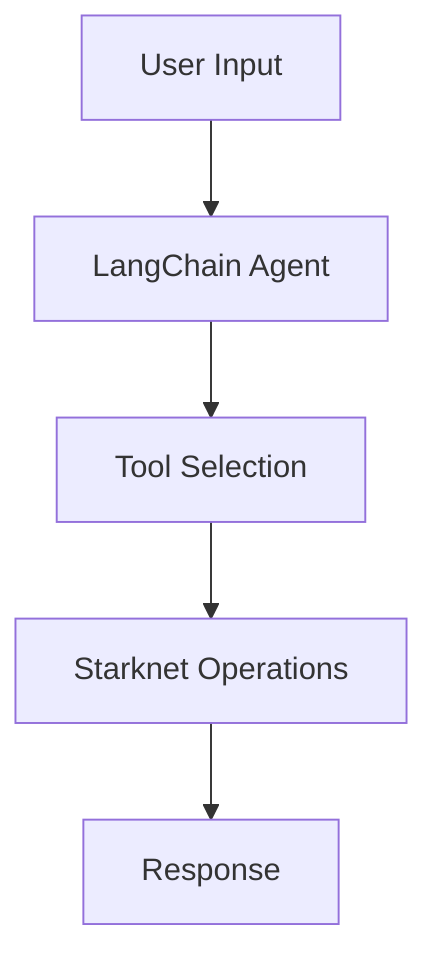

import { Callout } from 'nextra/components'
import { Cards, Card } from 'nextra/components'

# How Agents Work

Starknet Agent Kit uses LangChain to create AI-powered agents that can interact with the Starknet blockchain. Let's understand how this works under the hood.

## The Technology Stack

The kit combines several key technologies:

- **LangChain**: Framework for building LLM-powered applications
- **Language Models**: GPT-4, Claude, Gemini, etc.
- **Starknet.js**: For blockchain interactions
- **Custom Tools**: Predefined blockchain operations

## How It All Works Together

When you use a Starknet agent, here's what happens:



### 1. LangChain Agent

The kit uses LangChain's agent framework to:
- Process natural language input
- Choose appropriate tools
- Handle the execution flow

### 2. Tool System

Tools are predefined using LangChain's tool specification:
```typescript
// Example of how a tool is defined
{
  name: "transfer",
  description: "Transfer tokens to an address",
  schema: transferSchema,
  func: async (args) => {
    // Tool implementation
  }
}
```

### 3. Execution Flow

When you send a command like:
```typescript
await agent.execute("transfer 0.1 ETH to vitalik.stark");
```

The process is:

1. LangChain agent processes the input
2. Selects the appropriate tool
3. Extracts parameters
4. Executes the blockchain operation
5. Returns the result

<Callout>
The agent uses LangChain's ReAct (Reasoning + Acting) framework to make decisions about which tools to use and how to handle complex requests.
</Callout>

## Available Tools

The kit comes with built-in tools for common operations:

- **Account Management**: Transfers, balance checks
- **DeFi Operations**: Token swaps, liquidity
- **Information Retrieval**: Prices, transaction status
- **Custom Actions**: Add your own tools

## Extensibility

You can extend the agent's capabilities by:

1. Adding new LangChain tools
2. Creating custom Starknet operations
3. Integrating external APIs

## Next Steps

<Cards>
  <Card title="Agent Actions" href="/agent-actions">
    Explore available tools
  </Card>
  <Card title="Add Custom Actions" href="/add-agent-actions">
    Create your own tools
  </Card>
  <Card title="LangChain Tools" href="/integrate-langchain-tools">
    Add LangChain capabilities
  </Card>
</Cards>